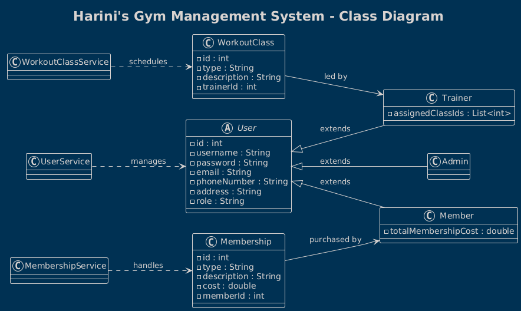

# Final Project Documentation – Gym Management System
**Course: Java Final Sprint – Winter 2025**  
**Developer: Harini Manohar**

---
## 1️⃣ User Documentation

### Overview

This Gym Management System is a Java-based console application designed for gyms to manage their users, memberships, and workout classes. It supports three user roles:
- **Admin**: Manage users and track revenue
- **Trainer**: Manage workout classes
- **Member**: View classes and purchase memberships

All data is securely stored in a PostgreSQL database, and login credentials are hashed using BCrypt for security.

---

### System Features

- Role-based login system (Admin, Trainer, Member)
- Secure password handling
- CRUD operations for workout classes and memberships
- Revenue tracking for admins
- Data persistence via JDBC and PostgreSQL

---

### How the System Works

1. **User registers** or logs in through the console interface
2. Based on role, the system displays a **custom menu**
3. All actions (register, view, update, delete) are stored in the database
4. Passwords are hashed before storing
5. Data can be retrieved or summarized (e.g., total revenue)

---

### Classes & Interactions

- `User`: Abstract class, extended by `Admin`, `Trainer`, and `Member`
- `UserService`: Handles login and registration (with password hashing)
- `UserDAO`: Connects to PostgreSQL to fetch/save user data
- `Membership`, `WorkoutClass`: Core models
- `MembershipService`, `WorkoutClassService`: Logic layers
- `GymApp`: Entry point with UI menus

---

### Class Diagram

> Diagram shows relationships between:  
`User` ⇨ `Admin`, `Trainer`, `Member`  
and how `WorkoutClass`, `Membership` relate to users.

---

### How to Run the App

git clone https://github.com/Manohar-H/Java_FinalSprint_Harini.git
cd Java_FinalSprint_Harini
mvn clean install
mvn exec:java -Dexec.mainClass="org.keyin.GymApp"

⸻

## 2️⃣ Development Documentation

### Project Structure

The Project follows this structure depicted below:

--- 

### Javadoc Examples

    /**
    * Handles user login using BCrypt.
    * @param username The entered username
    * @param password The raw password to verify
    * @return Logged-in User object if successful, null if not
    */
public User loginUser(String username, String password) { ... }

    /**
    * Lists all workout classes assigned to a trainer.
    */
public void showAllClasses() { ... }

All services and core models have full Javadoc-style comments.

---

### Build Instructions
1.	Install Java 17+
2.	Install Maven
3.	Run:
   `mvn clean install`
   ` mvn exec:java -Dexec.mainClass="org.keyin.GymApp"`

---

### Dependencies
	•	jbcrypt: for secure password hashing
	•	PostgreSQL JDBC Driver: for DB connectivity
	•	Maven: build & dependency manager

---    

### Database Setup
	•	See schema.sql to create tables
	•	See scripts.sql for insert statements & queries

*Run these in a PostgreSQL environment.*

⸻

## 3️⃣ Individual Report

###  My Contributions
	•	Built all classes and services from scratch
	•	Designed the database schema and logic
	•	Created multi-role UI with branching logic
	•	Wrote all DAO logic and handled merge conflicts
	•	Designed documentation and versioned everything via Git

### Challenges I Faced
	•	Password hashing and login validation using BCrypt
	•	Maven build issues on Mac
	•	Merging branches with conflicts
	•	Managing package structure and Java classpath in VS Code

⸻

Thank you for reviewing this project!
